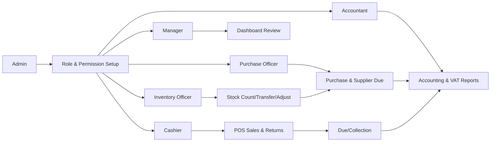
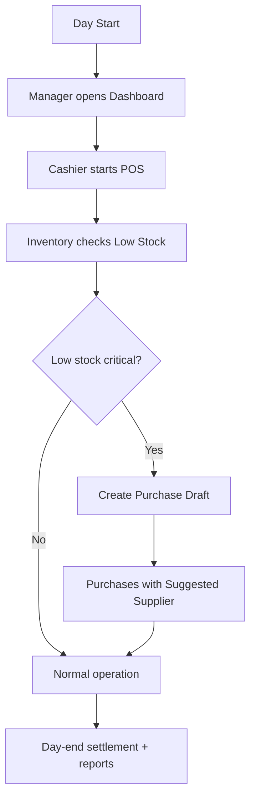
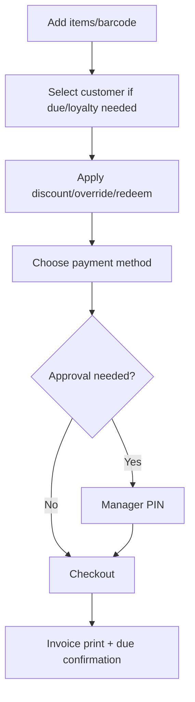
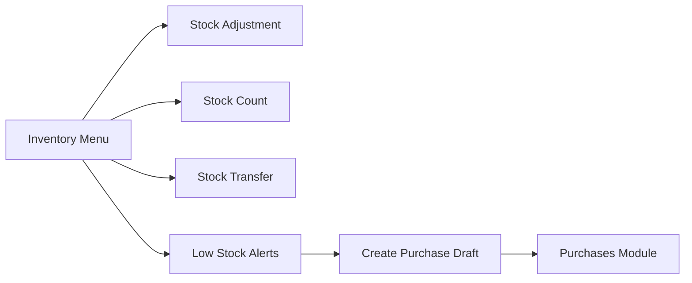
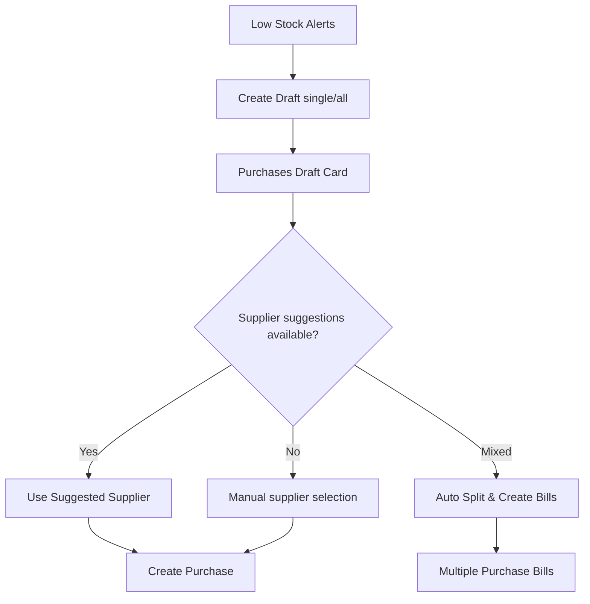
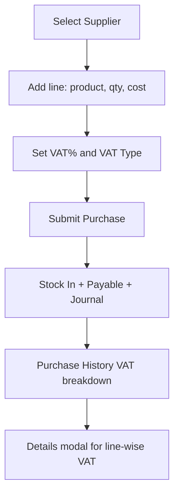
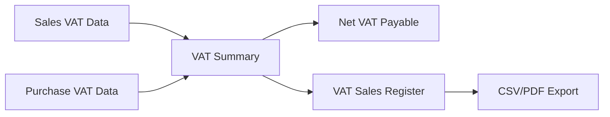
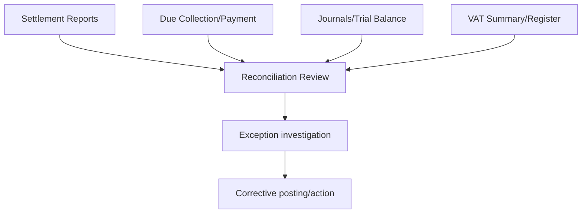
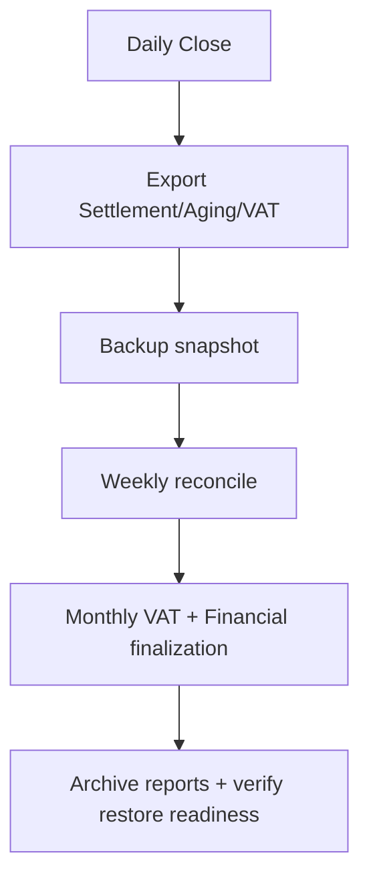
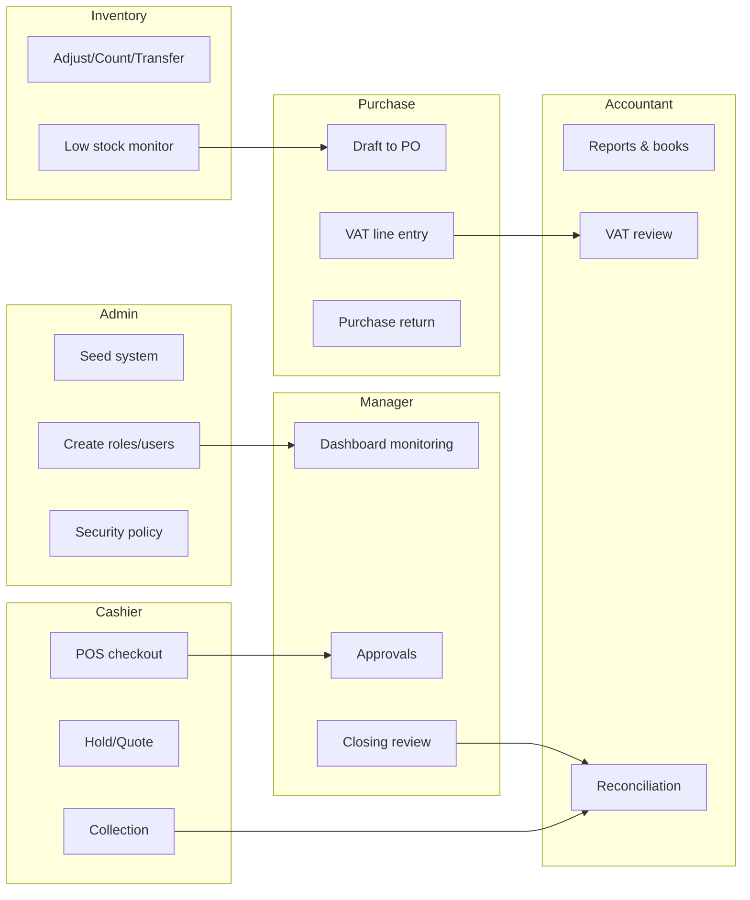

# BD Smart POS - Diagram-only Process Maps

Use this file for quick training sessions, operations briefings, and role onboarding.

---

## 1) End-to-end Operational Map

---

## 2) Daily Branch Flow

---

## 3) POS Checkout Flow

---

## 4) Inventory Flow

---

## 5) Replenishment Flow (Low Stock -> Purchase)

---

## 6) Purchase + VAT Capture Flow

---

## 7) VAT Compliance Flow (Current)

---

## 8) Accounting Reconciliation Flow

---

## 9) Period-end Closing Flow

---

## 10) Role-wise Swimlane (High Level)

