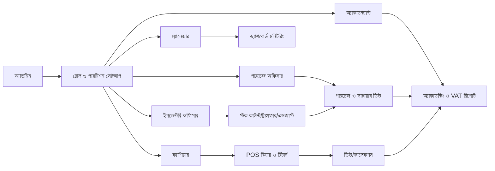
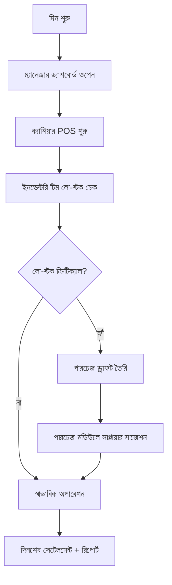
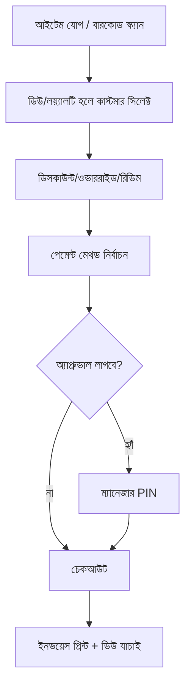
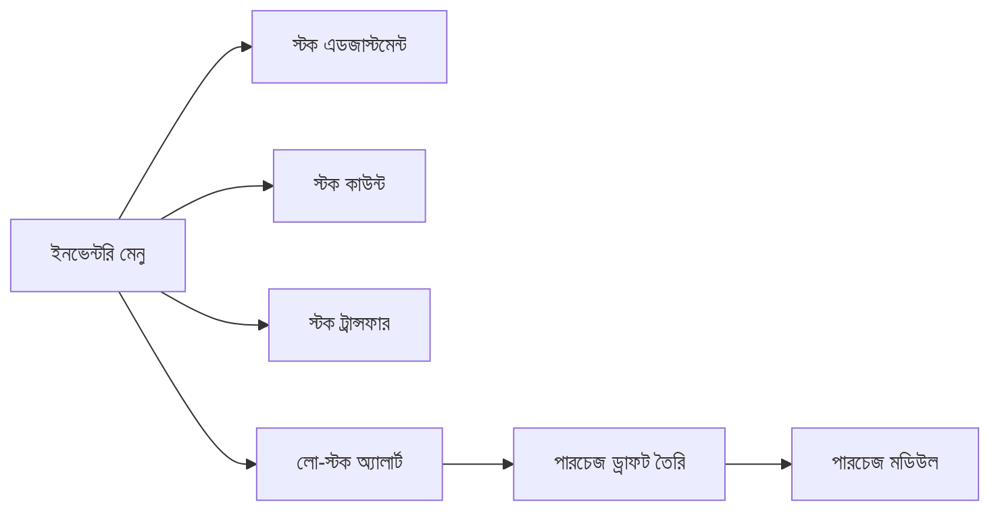
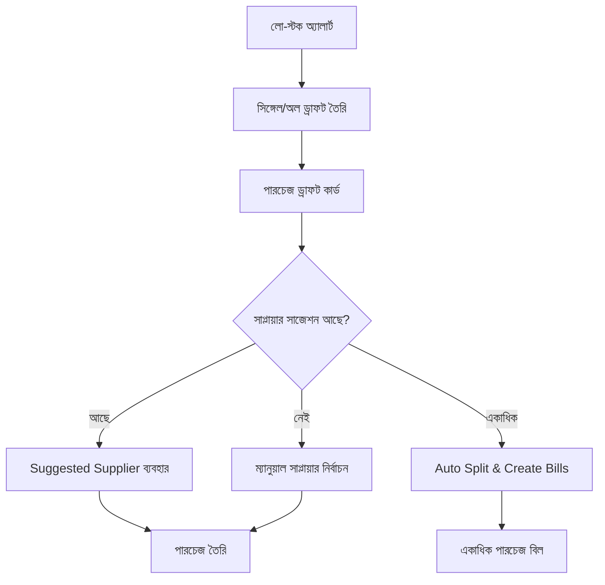
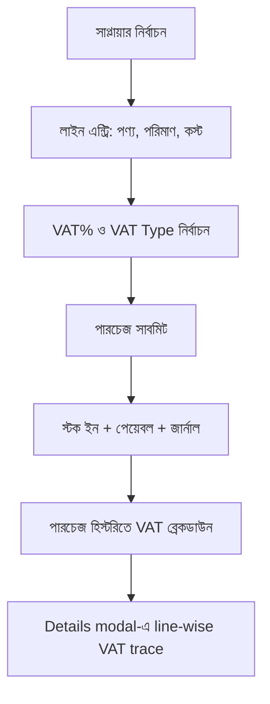
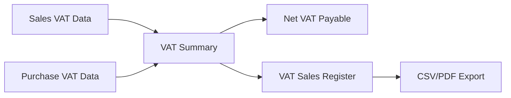
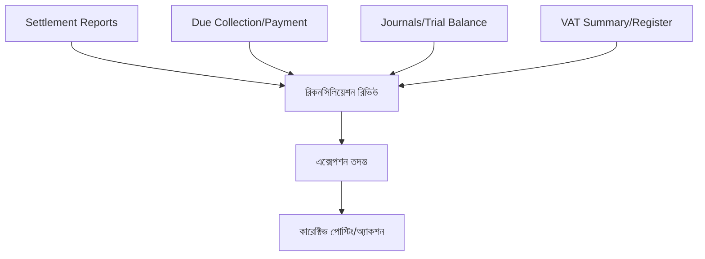
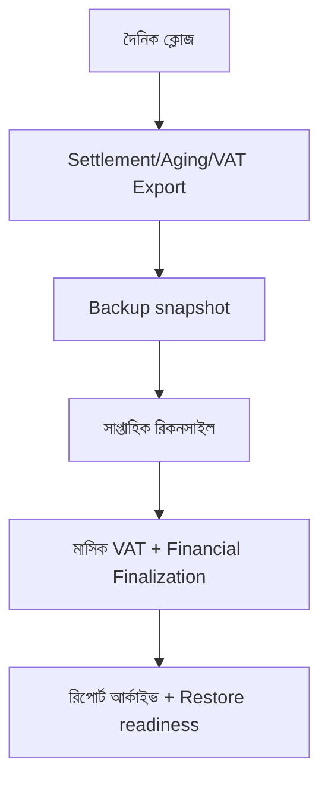
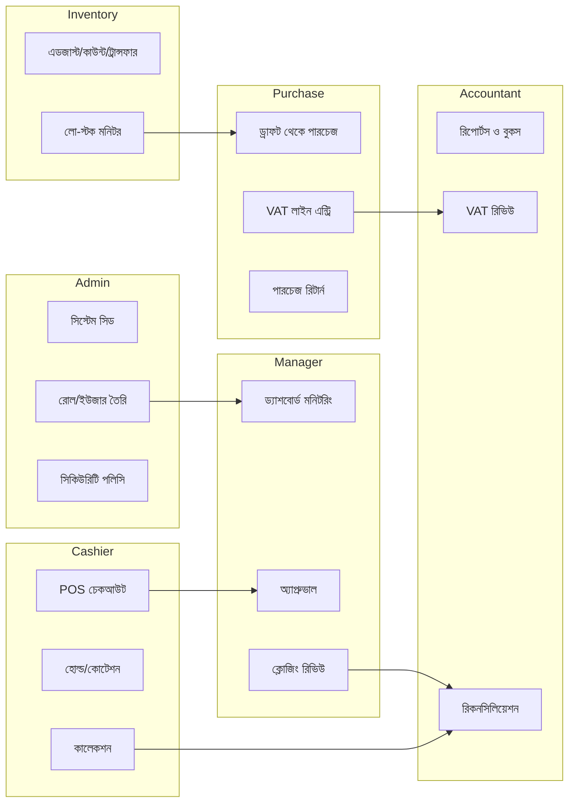

# BD Smart POS - ডায়াগ্রামভিত্তিক প্রসেস ম্যাপ (বাংলা)

এই ফাইলটি ট্রেনিং, অনবোর্ডিং এবং দৈনন্দিন অপারেশন বোঝানোর জন্য শুধুমাত্র ডায়াগ্রামভিত্তিক হ্যান্ডবুক।

---

## ১) পূর্ণাঙ্গ অপারেশন ম্যাপ

---

## ২) দৈনিক ব্রাঞ্চ অপারেশন ফ্লো

---

## ৩) POS চেকআউট ফ্লো

---

## ৪) ইনভেন্টরি ফ্লো

---

## ৫) রি-প্লেনিশমেন্ট ফ্লো (লো-স্টক -> পারচেজ)

---

## ৬) পারচেজ + VAT ক্যাপচার ফ্লো

---

## ৭) VAT কমপ্লায়েন্স ফ্লো (বর্তমান)

---

## ৮) অ্যাকাউন্টিং রিকনসিলিয়েশন ফ্লো

---

## ৯) পিরিয়ড-এন্ড ক্লোজিং ফ্লো

---

## ১০) রোলভিত্তিক সুইমলেন (হাই-লেভেল)

