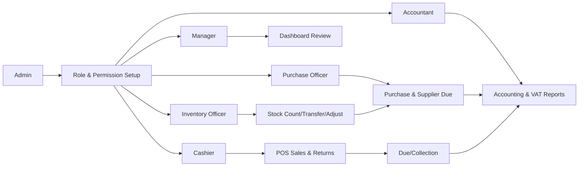
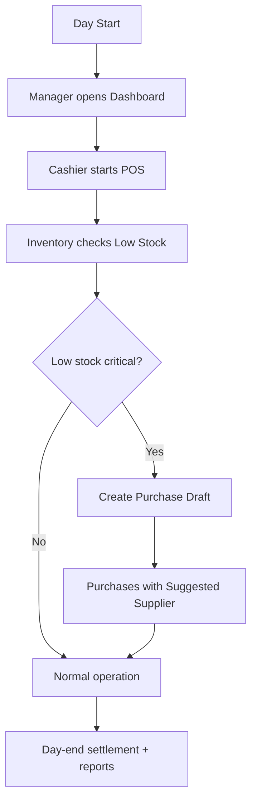
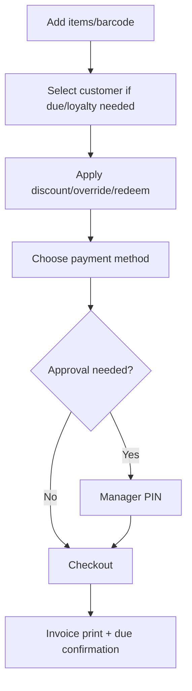
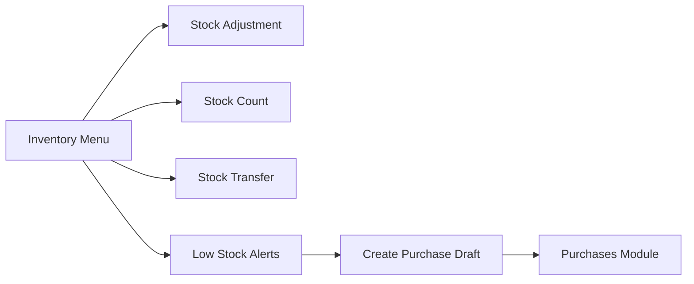
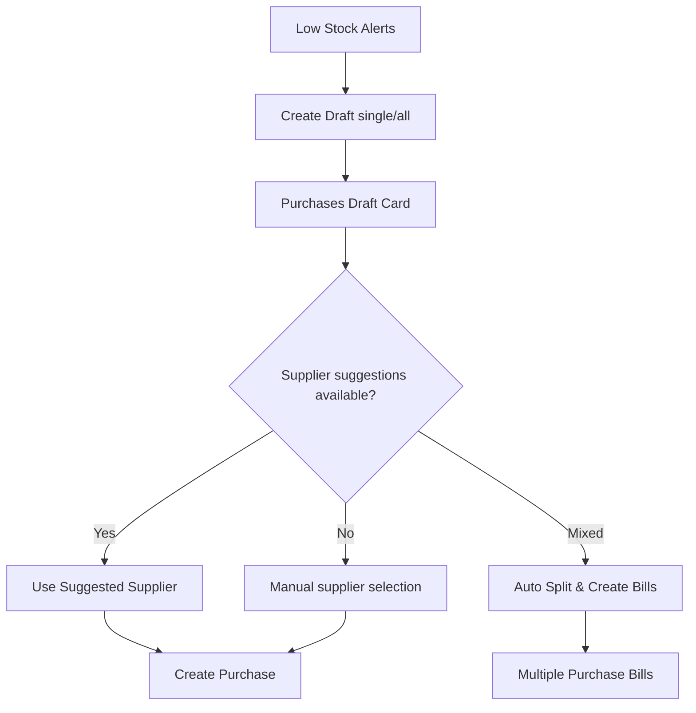
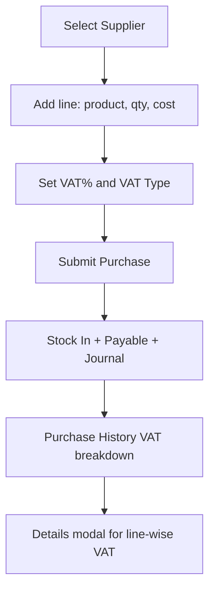
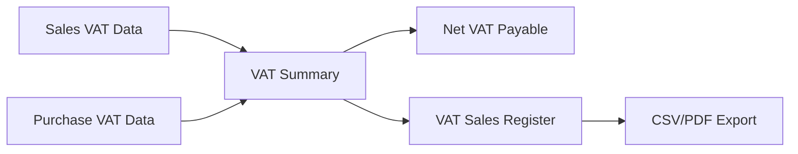
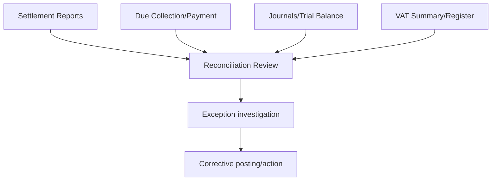
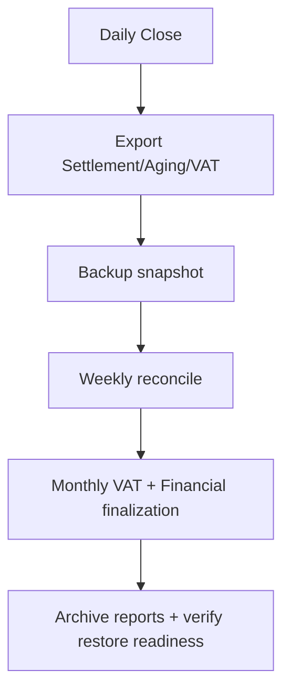
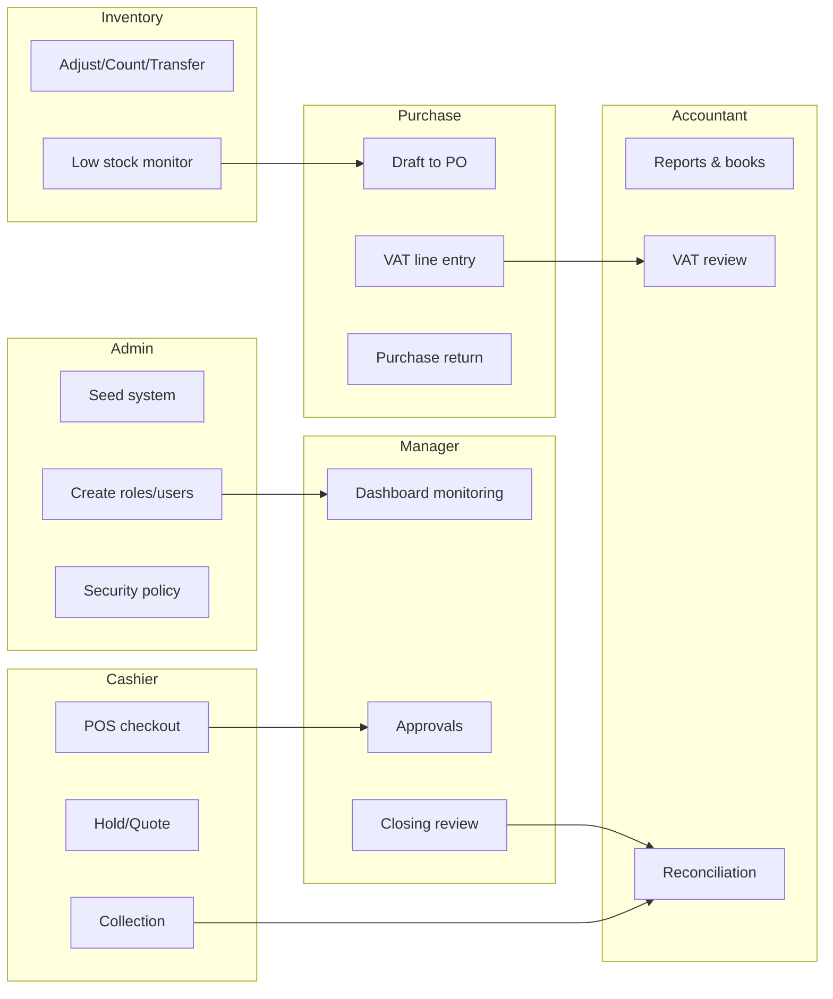

# BD Smart POS - Role-wise Process Guide (Bangladesh)

This guide explains how to run the system role by role, with practical daily processes and step-by-step flows.

Use this as your operational SOP for pilot/production-lite rollout.

---

## Visual Process Map (Diagram-first)

---

## 1) System Roles and Responsibility

## Admin (Owner / Super Admin)
- Seed and configure the system.
- Create branches, roles, users, and permissions.
- Approve high-risk overrides (discount, return, credit limit, stock count variance, hold-cart cross-user actions).
- Monitor compliance, backups, and controls.

## Manager (Branch Manager)
- Supervise daily sales and stock health.
- Approve exceptional actions as per policy.
- Review dashboards, due risks, and quote follow-ups.
- Ensure store-level discipline and shift compliance.

## Cashier (POS Operator)
- Run daily checkout, print invoices, manage held carts and quotations.
- Collect payments and handle split payment entry.
- Follow exception approval flow when required.

## Inventory / Store Officer
- Manage stock adjustments, stock counts, and branch transfers.
- Track low stock alerts and trigger purchase drafts.
- Maintain warehouse discipline and variance reasons.

## Purchase Officer
- Create purchase bills, purchase returns, and supplier due tracking.
- Maintain VAT inclusive/exclusive line entry accuracy.
- Use supplier suggestion and split-bill automation for draft replenishment.

## Accountant
- Review journals, trial balance, financial reports.
- Review VAT register and VAT summary.
- Reconcile due collection/payment and settlement reports.

---

## 2) Permission Model (Reference)

Permissions currently seeded in system:
- `branch.manage`
- `product.view`, `product.create`
- `sale.view`, `sale.create`, `sale.return`
- `rbac.manage`
- `inventory.view`, `inventory.adjust`, `inventory.transfer`
- `purchase.view`, `purchase.create`, `purchase.return`
- `accounting.view`, `accounting.journal.create`, `accounting.report`
- `report.view`
- `supplier.view`, `supplier.create`
- `customer.view`, `customer.create`
- `expense.view`, `expense.create`

Role templates available:
- Cashier
- Manager
- Accountant
- Admin

---

## 3) First-time Setup (Admin)

1. Configure backend and frontend `.env`.
2. Run backend schema sync and start backend.
3. Call `POST /api/bootstrap/seed` with branch/admin payload.
4. Login as admin (`admin@bdpos.local` by default if used in seed).
5. Go to Role Management:
   - Verify templates.
   - Create/update users per branch.
6. Configure master data:
   - Suppliers
   - Customers
   - Products (with SKU, VAT %, reorder level, default discounts)
7. Configure manager PIN policy and internal approval policy.

---

## 4) Daily Opening Process

## Manager
1. Login and open Dashboard.
2. Check:
   - Low stock priorities
   - Quote reminder overdue
   - Cashflow snapshot
3. Confirm cashier and inventory staff are assigned.

## Cashier
1. Login to POS.
2. Verify branch shown in top bar is correct.
3. Validate receipt settings (paper size, language, store info).
4. Test barcode scanner with 1 sample scan.

## Inventory Officer
1. Open Inventory.
2. Review low-stock alerts.
3. Create purchase draft for critical items if needed.

---

## 5) POS Checkout Process (Cashier)

1. Add products by click or barcode.
2. Enter customer (name/phone) when sale may include due or loyalty usage.
3. Apply:
   - product/line overrides if allowed
   - cart discount
   - loyalty redemption
4. Select payment:
   - cash/card/mobile banking/split.
5. Click checkout.

If approval needed:
- enter manager PIN (discount/price override/high redemption/credit over-limit).

After success:
- print invoice
- verify paid/due values.

---

## 6) Due / Credit Control Process

## Cashier
1. For due sale, ensure customer is selected.
2. If credit limit breach occurs, request manager PIN.
3. Complete sale only after approved PIN.

## Due Collection Officer / Accountant
1. Go to Due Collection.
2. Filter customer dues.
3. Post receipt voucher against customer due.
4. Confirm updated customer balance and journal impact.

---

## 7) Held Cart and Quotation Process

## Cashier
1. Hold cart if customer is undecided.
2. Add hold note.
3. Resume own hold directly.
4. For another cashier's hold, obtain manager PIN.

## Sales / Manager
1. Save sales quotation from POS.
2. Use quote reminder statuses:
   - OVERDUE / TODAY / TOMORROW / UPCOMING
3. Convert quote to sale when customer confirms.

---

## 8) Inventory Process (Store Officer)

## A) Manual Adjustment
1. Open Inventory.
2. Select product and warehouse (optional).
3. Enter `qtyChange` (+/-) and reason.
4. Submit and verify ledger entry.

## B) Stock Count
1. Create stock count session/schedule.
2. Count and submit counted quantities.
3. Add variance reason for mismatches.
4. Finalize session.
5. If high variance threshold is hit, manager PIN approval is required.

## C) Branch Transfer
1. Select destination branch.
2. Add transfer line(s):
   - source product
   - destination mapped product
   - quantity
3. Submit transfer and verify transfer history.

---

## 9) Replenishment Process (Low Stock -> Purchase)

1. Open Inventory low-stock list.
2. Use:
   - `Create Purchase Draft` (single item), or
   - `Create Draft for All Low/Out Items`.
3. System redirects to Purchases.
4. In Purchases draft card:
   - review suggested suppliers
   - use single supplier or
   - `Auto Split & Create Bills` by supplier.
5. Validate created bills in purchase history.

---

## 10) Purchase Bill Process (Purchase Officer)

1. Select supplier.
2. Add purchase line(s):
   - product, qty, cost
   - VAT %
   - VAT Type (`EXCLUSIVE` or `INCLUSIVE`)
3. Submit purchase.
4. Verify:
   - stock increased
   - supplier payable updated
   - accounting journal posted.

## Purchase Return
1. Select purchase bill.
2. Choose item and qty for return.
3. Enter reason and submit.
4. Verify stock/payable/journal impact.

---

## 11) VAT Compliance Process (Current)

## Available now
1. Go to Reports.
2. Use date filter.
3. Review:
   - VAT Summary
   - VAT Sales Register
4. Export:
   - VAT Sales Register CSV/PDF

## Purchase VAT trace
1. Open Purchases.
2. In purchase history, click `Details`.
3. Review line-wise VAT trace:
   - taxable
   - VAT rate/type
   - VAT amount
   - gross

## Important note
- Input VAT is exact for purchases captured with new VAT audit payload.
- Older purchases may be estimated using product VAT rate.

---

## 12) Accounting and Reconciliation Process

## Accountant Daily
1. Review settlement:
   - payment method/channel
   - paid vs due
2. Review dues:
   - customer receivable
   - supplier payable
3. Review Accounting module:
   - journals
   - trial balance
   - P&L
   - balance sheet
4. Investigate mismatches:
   - payment channel totals vs vouchers vs journals

---

## 13) Dashboard Review Process (Manager/Admin)

Use Dashboard at least 3 times/day:
- Opening
- Mid-day
- Closing

Check:
1. Sales and collection trend (vs yesterday).
2. Purchase and low-stock trend.
3. Cashflow snapshot.
4. Top payment methods.
5. Top products.
6. Low-stock priorities.
7. Recent sales and quote follow-up counts.

---

## 14) Period-End / Closing Checklist

## Daily close
1. Confirm no pending critical approvals.
2. Confirm due collections posted.
3. Export key reports:
   - settlement
   - aging
   - VAT sales register
4. Save backup snapshot.

## Weekly close
1. Reconcile receivable/payable movements.
2. Review stock count variance patterns.
3. Review role/permission drift.

## Monthly close
1. Finalize VAT summary and register export.
2. Verify accounting statements.
3. Archive month-end reports and backups.

---

## 15) Exception Handling SOP

## A) Wrong sale entry
1. Use Sales Return with reason.
2. Manager PIN approval required.
3. Recreate corrected sale.

## B) Stock mismatch
1. Run stock count session.
2. Record reasons.
3. Finalize with approval if high variance.

## C) User cannot access module
1. Verify role template and permission mapping.
2. Re-assign permissions from Role Management.
3. Re-login to refresh token permissions.

## D) Credit limit block at checkout
1. Verify customer due and credit limit.
2. Use manager PIN if business-approved override.
3. Prefer partial collection to reduce due.

---

## 16) Security and Control SOP (Must Follow)

1. Change default admin password immediately.
2. Set strong `JWT_SECRET`.
3. Restrict backend CORS origin in production.
4. Limit manager PIN sharing.
5. Use role-based least privilege.
6. Keep backup retention and restore drill process.
7. Keep audit logs retained and reviewed.

---

## 17) Suggested Training Plan

## Day 1
- Cashier: POS, payment, hold/quote, return.
- Inventory: low-stock, adjustment, transfer, stock count.

## Day 2
- Purchase officer: draft -> supplier suggestion -> split purchase -> VAT type.
- Accountant: reports, VAT register, reconciliation.

## Day 3
- Manager/Admin: approvals, dashboards, exception handling, role governance.

---

## 18) Quick Go-Live Readiness Checklist

- [ ] Users and roles configured.
- [ ] Product VAT and reorder level complete.
- [ ] Supplier/customer masters cleaned.
- [ ] Manager PIN policy published.
- [ ] Daily backup job active.
- [ ] Reports export tested (CSV/PDF).
- [ ] VAT summary + sales register verified.
- [ ] Purchase VAT detail modal validated for sample bills.
- [ ] Recovery test performed once.

---

## Appendix: Role-wise Swimlane (High Level)

