# BD Smart POS — ব্যবহারকারী গাইড (বাংলা)

> **কার জন্য:** দোকানের মালিক, ম্যানেজার, ক্যাশিয়ার ও অন্যান্য কর্মী  
> **সংস্করণ:** ২০২৬ · বাংলাদেশ রিটেইল/পস সফটওয়্যার

---

## সূচিপত্র

1. [সফটওয়্যার সম্পর্কে](#১-সফটওয়্যার-সম্পর্কে)
2. [প্রথমবার শুরু করা](#২-প্রথমবার-শুরু-করা)
3. [মেনু ও নেভিগেশন](#৩-মেনু-ও-নেভিগেশন)
4. [POS — বিক্রয়](#৪-pos--বিক্রয়)
5. [পণ্য ও ইনভেন্টরি](#৫-পণ্য-ও-ইনভেন্টরি)
6. [ক্রয় ও সাপ্লায়ার](#৬-ক্রয়-ও-সাপ্লায়ার)
7. [গ্রাহক ব্যবস্থাপনা](#৭-গ্রাহক-ব্যবস্থাপনা)
8. [বাকি সংগ্রহ ও বাকির খাতা](#৮-বাকি-সংগ্রহ-ও-বাকির-খাতা)
9. [লয়ালটি ও গিফট কার্ড](#৯-লয়ালটি-ও-গিফট-কার্ড)
10. [KYC, ওয়ারেন্টি ও কমপ্লায়েন্স](#১০-kyc-ওয়ারেন্টি-ও-কমপ্লায়েন্স)
11. [অর্থ, হিসাব ও রিপোর্ট](#১১-অর্থ-হিসাব-ও-রিপোর্ট)
12. [বিশেষ ব্যবসার মডিউল](#১২-বিশেষ-ব্যবসার-মডিউল)
13. [অনলাইন দোকান ও অর্ডার](#১৩-অনলাইন-দোকান-ও-অর্ডার)
14. [সেটিংস ও হার্ডওয়্যার](#১৪-সেটিংস-ও-হার্ডওয়্যার)
15. [ভূমিকা অনুযায়ী কাজ](#১৫-ভূমিকা-অনুযায়ী-কাজ)
16. [দোকানের গ্রাহকদের জন্য](#১৬-দোকানের-গ্রাহকদের-জন্য)
17. [সাধারণ সমস্যা ও সমাধান](#১৭-সাধারণ-সমস্যা-ও-সমাধান)
18. [প্রক্রিয়া ফ্লো (Process Flow)](#১৮-প্রক্রিয়া-ফ্লো-process-flow)

---

## ১. সফটওয়্যার সম্পর্কে

**BD Smart POS** বাংলাদেশের খুচরা, পাইকারি, ফার্মেসি, রেস্তোরাঁ, ইলেকট্রনিক্স ও সুপারশপের জন্য তৈরি একটি সম্পূর্ণ পয়েন্ট অফ সেল (POS) সিস্টেম। এতে আছে:

- দ্রুত POS বিক্রয় (নগদ, bKash, Nagad, কার্ড, বাকি)
- স্টক ও ওয়্যারহাউজ ব্যবস্থাপনা
- গ্রাহক বাকি (বাকির খাতা) ও SMS স্টেটমেন্ট
- VAT, Mushak ও EFD রসিদ সহায়তা
- লয়ালটি পয়েন্ট, গিফট কার্ড
- অনলাইন দোকান (QR লিংক)
- রোল ও অনুমতি (কে কী করতে পারবে)

---

## ২. প্রথমবার শুরু করা

### ২.১ লগইন

1. ব্রাউজারে POS অ্যাড্রেস খুলুন (যেমন: `http://localhost:5173` বা আপনার সার্ভার URL)।
2. **ইমেইল** ও **পাসওয়ার্ড** দিয়ে লগইন করুন।
3. প্রথমবার সেটআপে সিস্টেম অ্যাডমিন আপনাকে লগইন তথ্য দেবে।

> **নিরাপত্তা:** প্রথম লগইনের পর পাসওয়ার্ড পরিবর্তন করুন। ম্যানেজার PIN সেটিংসে সেট করুন।

### ২.২ ভাষা বদলানো

- লগইন পেজ বা সেটিংস থেকে **বাংলা / English** বেছে নিন।
- বাংলা নির্বাচন করলে পুরো মেনু বাংলায় দেখাবে।

### ২.৩ শাখা (Branch) নির্বাচন

একাধিক শাখা থাকলে:

1. উপরের **Branch #** থেকে সঠিক শাখা বেছে নিন।
2. প্রতিটি শাখার স্টক, বিক্রয় ও হিসাব আলাদা থাকে।

### ২.৪ মেনু সাজানো

- প্রায়ই ব্যবহৃত পেজের পাশে **Pin to top** চাপলে সেটি মেনুর উপরে থাকবে।
- **Search menu** দিয়ে দ্রুত পেজ খুঁজুন (যেমন: `pos`, `বাকি`)।
- **Shortcuts** বাটনে কীবোর্ড শর্টকাট দেখুন।

---

## ৩. মেনু ও নেভিগেশন

মেনু চারটি গ্রুপে ভাগ:

| গ্রুপ | কাজ |
|--------|-----|
| **দৈনন্দিন** | POS, রিটার্ন, কোটেশন, অর্ডার, রিচার্জ, রেস্তোরাঁ, শিফট |
| **ইনভেন্টরি** | পণ্য, স্টক, ক্রয়, সাপ্লায়ার, গ্রাহক, ওয়ারেন্টি |
| **অর্থ** | খরচ, বাকি সংগ্রহ, হিসাব, রিপোর্ট, লয়ালটি |
| **অ্যাডমিন** | রোল, ওয়েবহুক, সেটিংস |

> আপনি শুধু সেই পেজগুলো দেখবেন যার **অনুমতি** আপনার রোলে আছে। পেজ খুলতে না পারলে ম্যানেজারকে **Role Management**-এ অনুমতি দিতে বলুন।

---

## ৪. POS — বিক্রয়

### ৪.১ সাধারণ বিক্রয় (ধাপে ধাপে)

1. মেনু থেকে **পস (POS)** খুলুন।
2. **বারকোড স্ক্যান** করুন অথবা পণ্যের নাম লিখে খুঁজুন।
3. কার্টে পণ্য যোগ হলে পরিমাণ ঠিক করুন।
4. (ঐচ্ছিক) **গ্রাহক** বেছে নিন — বাকি বিক্রয় বা লয়ালটি পয়েন্টের জন্য।
5. **ছাড় / প্রোমো** প্রয়োগ করুন (যদি থাকে)।
6. **পেমেন্ট পদ্ধতি** বেছে নিন:
   - নগদ (Cash)
   - bKash / Nagad / Rocket
   - ব্যাংক / কার্ড
   - **বাকি (Credit)** — গ্রাহকের ক্রেডিট লিমিটের মধ্যে
7. **Complete sale** চাপুন।
8. রসিদ **প্রিন্ট** করুন (প্রিন্ট ব্রিজ কনফিগার থাকলে)।

### ৪.২ ওজন/PLU স্কেল পণ্য

- স্কেল থেকে PLU বারকোড স্ক্যান করলে ওজন ও দাম অটো হিসাব হয়।
- **Sell by weight** চালু পণ্যে KG/GM অনুযায়ী বিক্রয় হয়।

### ৪.৩ সিরিয়াল / IMEI (মোবাইল ও ইলেকট্রনিক্স)

- **Track serial** চালু পণ্য বিক্রয়ের সময় IMEI/সিরিয়াল নম্বর দিতে হবে।
- পরবর্তীতে **Sales Lookup** বা **Warranty claims**-এ সিরিয়াল দিয়ে খুঁজে পাওয়া যাবে।

### ৪.৪ KYC প্রয়োজনীয় পণ্য (SIM / আর্থিক)

- পণ্যে **Requires KYC** চালু থাকলে:
  - গ্রাহকের **NID** বা **জন্ম নিবন্ধন** Customers-এ থাকতে হবে, **অথবা**
  - POS-এ buyer NID/note (১০+ অক্ষর) দিতে হবে।
- KYC ছাড়া বিক্রয় সম্পন্ন হবে না।

### ৪.৫ Mushak / VAT রসিদ

- শাখায় BIN/VAT তথ্য সেটিংসে থাকলে রসিদে VAT ও Mushak ৬.৩ তথ্য যাবে।
- **Sales Lookup** থেকে XML/PDF ডাউনলোড করা যায়।

### ৪.৬ বিক্রয় রিটার্ন

1. **বিক্রয় রিটার্ন** পেজ খুলুন।
2. ইনভয়েস নম্বর বা বিক্রয় ID দিন।
3. ফেরত যাওয়া পণ্য ও পরিমাণ বেছে নিন।
4. রিটার্ন সম্পন্ন করুন — স্টক ও হিসাব আপডেট হবে।

### ৪.৭ শিফট (Shift)

- দিন শুরুতে **Shifts**-এ শিফট খুলুন।
- শিফট শেষে ক্যাশ গণনা করে শিফট বন্ধ করুন।
- ম্যানেজার রিপোর্টে পার্থক্য (short/over) দেখতে পারবেন।

---

## ৫. পণ্য ও ইনভেন্টরি

### ৫.১ নতুন পণ্য যোগ

1. **পণ্য (Products)** → ফর্ম পূরণ করুন:
   - নাম (বাংলা/ইংরেজি), SKU, বারকোড
   - ক্রয়/বিক্রয়/MRP মূল্য
   - VAT হার, HS Code
   - ক্যাটাগরি, ব্র্যান্ড
2. **Inventory** সেকশনে:
   - Batch tracked (ব্যাচ)
   - Track expiry (মেয়াদ)
   - Track serial (IMEI)
   - Requires KYC (SIM/আর্থিক)
3. **Save** করুন।

### ৫.২ স্টক দেখা ও সমন্বয়

- **ইনভেন্টরি:** বর্তমান স্টক, ব্যাচ, মেয়াদ।
- **স্টক কাউন্ট:** ভৌত গণনার পর সিস্টেমের সাথে মিলিয়ে সমন্বয়।
- **Warehouses:** একাধিক গুদাম/শেল্ফ।

### ৫.৩ প্রোমোশন

- BOGO, ক্যাটাগরি ছাড়, কার্ট অফার **Promotions**-এ সেট করুন।
- POS-এ স্বয়ংক্রিয় প্রয়োগ হবে (শর্ত মিললে)।

---

## ৬. ক্রয় ও সাপ্লায়ার

### ৬.১ সাপ্লায়ার যোগ

**সাপ্লায়ার** পেজে নাম, ফোন, ঠিকানা, BIN (যদি থাকে) দিন।

### ৬.২ ক্রয় বিল (Purchase)

1. **ক্রয় (Purchases)** → নতুন বিল।
2. সাপ্লায়ার, পণ্য, পরিমাণ, দাম দিন।
3. পেমেন্ট: নগদ / বাকি / ব্যাংক লোন।
4. সেভ করলে স্টক বাড়ে ও সাপ্লায়ার বাকি (যদি থাকে) রেকর্ড হয়।

### ৬.৩ সাপ্লায়ার বাকি পরিশোধ

**বাকি সংগ্রহ (Due Collection)** → সাপ্লায়ার সেকশনে বাকি পরিশোধ করুন।

---

## ৭. গ্রাহক ব্যবস্থাপনা

### ৭.১ গ্রাহক যোগ/সম্পাদনা

**কাস্টমার (Customers)** পেজে:

| ক্ষেত্র | ব্যবহার |
|--------|---------|
| নাম, ফোন, ঠিকানা | যোগাযোগ ও SMS |
| জেলা, এলাকা | ডেলিভারি |
| Credit limit | সর্বোচ্চ বাকি সীমা |
| Birth date | জন্মদিন অফার |
| NID / জন্ম নিবন্ধন | KYC (SIM/আর্থিক বিক্রয়) |
| Price tier | Retail / Wholesale / Dealer |

### ৭.২ গ্রাহক বিবরণ

- **Details** চাপলে: বাকি, ক্রেডিট সীমা, লয়ালটি পয়েন্ট, KYC স্ট্যাটাস দেখা যাবে।
- **Account statement PDF** ডাউনলোড করা যায়।

### ৭.৩ লয়ালটি QR কার্ড ইস্যু

1. গ্রাহকের **ফোন নম্বর** অবশ্যই থাকতে হবে।
2. Details → **Issue loyalty QR card**।
3. QR **প্রিন্ট** করে গ্রাহককে দিন।
4. গ্রাহক QR স্ক্যান করে SMS OTP দিয়ে পয়েন্ট দেখতে পারবেন (বিস্তারিত: [§১৬](#১৬-দোকানের-গ্রাহকদের-জন্য))।

---

## ৮. বাকি সংগ্রহ ও বাকির খাতা

### ৮.১ গ্রাহকের বাকি সংগ্রহ

1. **বাকি সংগ্রহ (Due Collection)** খুলুন।
2. **Collect customer due** সেকশনে:
   - গ্রাহক বেছে নিন
   - পরিমাণ, পদ্ধতি (Cash/bKash/Bank…) দিন
   - **Collect due** চাপুন
3. হিসাব ও গ্রাহক ব্যালেন্স আপডেট হবে।

### ৮.২ বাকির খাতা (Digital Bakir Khata)

গ্রাহক বেছে নিলে নিচে **বাকির খাতা** প্যানেল দেখা যাবে:

- প্রতিটি **বাকি বিক্রয়** (+) ও **জমা** (−) লাইন
- বর্তমান বকেয়া

**Send Bangla statement SMS** চাপলে গ্রাহকের ফোনে বাংলায় স্টেটমেন্ট যাবে।  
(SMS পাঠাতে সার্ভারে `SMS_PROVIDER` কনফিগার করতে হবে; না থাকলে লগে সিমুলেট হবে।)

### ৮.৩ বাকি রিমাইন্ডার SMS

উপরের **Baki reminder SMS** দিয়ে একসাথে অনেক গ্রাহককে বাকির অনুস্মারক পাঠানো যায়।

---

## ৯. লয়ালটি ও গিফট কার্ড

### ৯.১ লয়ালটি প্রোগ্রাম (দোকানের জন্য)

**লয়ালটি (Loyalty)** ড্যাশবোর্ডে:

- পয়েন্ট নিয়ম, টিয়ার
- মেয়াদ শেষ হওয়া পয়েন্ট
- Aisle bonus (নির্দিষ্ট ক্যাটাগরিতে অতিরিক্ত পয়েন্ট)

সেটিংস → Loyalty/Aisle bonus থেকে শাখা অনুযায়ী কনফিগার করুন।

### ৯.২ গিফট কার্ড

**Gift Cards**-এ কার্ড ইস্যু, লোড ও রিডিম করুন। POS-এ গিফট কার্ড পেমেন্ট হিসেবে ব্যবহার করা যায়।

---

## ১০. KYC, ওয়ারেন্টি ও কমপ্লায়েন্স

### ১০.১ KYC (NID / জন্ম নিবন্ধন)

- **Customers**-এ গ্রাহকের NID বা জন্ম নিবন্ধন নম্বর সংরক্ষণ করুন।
- **Products**-এ SIM/আর্থিক পণ্যে **Requires KYC** চালু রাখুন।
- POS বিক্রয়ের সময় KYC যাচাই হবে।

### ১০.২ ওয়ারেন্টি দাবি

1. **Warranty claims (ওয়ারেন্টি দাবি)** খুলুন।
2. ইনভয়েসের **সিরিয়াল/IMEI** ও সমস্যার বর্ণনা দিন।
3. **Submit** → স্ট্যাটাস: Open → Approved/Rejected → Completed/Replaced
4. সিরিয়াল-tracked বিক্রয় থেকে ওয়ারেন্টি মেয়াদ অটো দেখায়।

### ১০.৩ EFD / Mushak (VAT)

- **Settings**-এ EFD (Electronic Fiscal Device) কনফিগার করুন।
- বিক্রয় রসিদে EFD QR যোগ হতে পারে।
- **Sales Lookup** → Mushak ৬.৩ XML / Mushak ৯.১ e-filing (অ্যাডমিন)।

---

## ১১. অর্থ, হিসাব ও রিপোর্ট

| পেজ | কাজ |
|-----|-----|
| **খরচ (Expenses)** | দোকানের Operating খরচ রেকর্ড |
| **হিসাবরক্ষণ (Accounting)** | Chart of Accounts, Trial Balance |
| **Settlements** | bKash/Nagad মিল (reconciliation) |
| **Digital transfer** | নগদ ↔ ডিজিটাল স্থানান্তর |
| **Bank import** | ব্যাংক স্টেটমেন্ট CSV মিল |
| **Fiscal periods** | অর্থবছর বন্ধ/খোলা |
| **Petty cash** | ছোট খরচের তহবিল |
| **Cheques** | চেক রেজিস্টার |
| **Assets** | সম্পদ ও depreciatio |
| **Reports** | বিক্রয়, স্টক, aging, VAT রিপোর্ট |

> বেশিরভাগ অর্থ পেজ **accounting.report** বা **accounting.view** অনুমতি চায়।

---

## ১২. বিশেষ ব্যবসার মডিউল

### ১২.১ ফার্মেসি

- **Prescriptions:** প্রেসক্রিপশন সংযুক্ত বিক্রয়।
- Batch + expiry tracking পণ্যে চালু রাখুন।

### ১২.২ রেস্তোরাঁ

- **Restaurant:** টেবিল, KOT, অর্ডার।
- Settings থেকে **Table QR** — `#/storefront?token=…&table=৫` লিংকে ডাইন-ইন অর্ডার।

### ১২.৩ রিচার্জ ও ইউটিলিটি বিল

- **রিচার্জ ও বিল:** মোবাইল রিচার্জ, বিদ্যুৎ/গ্যাস/পানি বিল।
- Float balance, কমিশন ও স্লিপ প্রিন্ট।

### ১২.৪ ম্যানুফ্যাকচারিং

- **Manufacturing:** BOM, উৎপাদন অর্ডার, কাঁচামাল → finished goods।

### ১২.৫ অর্ডার ইনবক্স

- অনলাইন/F-commerce অর্ডার **Order Inbox**-এ আসে।
- POS-এ রূপান্তর বা স্ট্যাটাস আপডেট করুন।

---

## ১৩. অনলাইন দোকান ও অর্ডার

### ১৩.১ দোকানের লিংক তৈরি

1. **Settings** → Storefront / F-commerce সেকশন।
2. **Storefront token** জেনারেট করুন।
3. **QR কোড** প্রিন্ট করে দোকানে ঝুলান বা Facebook/WhatsApp-এ শেয়ার করুন।

### ১৩.২ গ্রাহক কী করবে

- QR/লিংক খুলে পণ্য দেখবে, কার্টে যোগ করবে।
- COD বা bKash/Nagad দিয়ে অর্ডার দেবে।
- অর্ডার **Order Inbox**-এ পৌঁছাবে।

### ১৩.৩ কাস্টমার ডিসপ্লে

- `#/customer-display` — দ্বিতীয় স্ক্রিনে গ্রাহকের কার্ট/মোট দেখানোর জন্য।

---

## ১৪. সেটিংস ও হার্ডওয়্যার

### ১৪.১ সেটিংস (Settings) — মূল বিষয়

| বিষয় | বর্ণনা |
|-------|--------|
| Branch profile | নাম, ঠিকানা, BIN, Trade license |
| Business profile | Grocery / Pharmacy / Mixed… |
| Language | UI ভাষা |
| Loyalty | Aisle bonus, points expiry |
| Print bridge | থার্মাল প্রিন্টার URL |
| Touch mode | টাচ-ফ্রেন্ডলি POS |
| Storefront | অনলাইন দোকান token ও QR |
| EFD / Courier / MFS | ইনtegration credentials |
| Manager PIN | ছাড়/void অনুমোদন |

### ১৪.২ প্রিন্টার ও ক্যাশ ড্রয়ার

1. Settings → **Print bridge URL** (যেমন: `http://127.0.0.1:9101`)।
2. **Test receipt** চাপে পরীক্ষা করুন।
3. **Kick cash drawer** দিয়ে ড্রয়ার খোলার পরীক্ষা।

### ১৪.৩ PWA / অফলাইন

- POS PWA হিসেবে ইনস্টল করা যায় (Chrome → Install)।
- সীমিত অফলাইন ক্যাশ (যদি চালু থাকে) — নেট ফিরলে সিঙ্ক।

---

## ১৫. ভূমিকা অনুযায়ী কাজ

সিস্টেমে **Role Management**-এ কাস্টম রোল তৈরি করা যায়। সাধারণ দায়িত্ব:

### Admin (পূর্ণ অনুমতি)

- সব পেজ, সেটিংস, রোল, ব্রাঞ্চ, bootstrap
- EFD/MFS/Courier credentials
- Fiscal period বন্ধ

### Manager / Owner

- POS + রিটার্ন + রিপোর্ট + বাকি সংগ্রহ
- পণ্য/ক্রয় অনুমোদন
- ছাড়/void (Manager PIN)
- Loyalty, Bakir Khata SMS

### Cashier / Sales

- POS বিক্রয়, শিফট
- গ্রাহক খোঁজ (view)
- রিটার্ন (যদি `sale.return` থাকে)

### Inventory staff

- পণ্য, স্টক, ক্রয়, stock count
- Warehouse transfer

### Accountant

- Accounting, reports, settlements, bank import
- Expenses, cheques, assets

> **Tip:** Role Management → Role select → Page access map দেখে কোন পেজ খোলা যাবে তা চেক করুন।

---

## ১৬. দোকানের গ্রাহকদের জন্য

> এই অংশ **দোকানের ক্রেতা** (retail customer)-দের জন্য — কর্মীরা গ্রাহককে বুঝিয়ে দিতে পারেন।

### ১৬.১ লয়ালটি কার্ড (QR)

1. দোকান থেকে **লয়ালটি QR কার্ড** নিন।
2. ফোন দিয়ে QR **স্ক্যান** করুন।
3. দোকানে **নিবন্ধিত মোবাইল নম্বর** দিন।
4. **OTP** SMS পাবেন → OTP দিয়ে যাচাই করুন।
5. **উপলব্ধ পয়েন্ট** ও মেয়াদ শেষ হওয়া পয়েন্ট দেখুন।

### ১৬.২ অনলাইন অর্ডার

1. দোকানের **QR/লিংক** খুলুন।
2. পণ্য কার্টে যোগ করুন।
3. নাম, ফোন, ঠিকানা দিন।
4. **COD** বা bKash/Nagad বেছে নিন।
5. MFS হলে QR দেখে পেমেন্ট → TrxID দিয়ে **verify** → অর্ডার confirm।

### ১৬.৩ বাকির SMS স্টেটমেন্ট

- দোকান থেকে **বাকির খাতা SMS** পেলে সাম্প্রতিক লেনদেন ও মোট বাকি দেখুন।
- প্রশ্ন থাকলে দোকানের কাউন্টারে যোগাযোগ করুন।

---

## ১৭. সাধারণ সমস্যা ও সমাধান

| সমস্যা | সমাধান |
|--------|--------|
| লগইন হচ্ছে না | ইমেইল/পাসওয়ার্ড চেক; Admin-কে জানান |
| পেজ দেখা যাচ্ছে না | Role Management-এ অনুমতি দিন |
| POS-এ পণ্য পাওয়া যায় না | Products-এ `isActive` ও স্টক চেক করুন |
| KYC error | Customers-এ NID/জন্ম নিবন্ধন যোগ করুন |
| বাকি বিক্রয় block | Credit limit বাড়ান বা আগের বাকি কমান |
| SMS যাচ্ছে না | Admin: `SMS_PROVIDER` env কনফিগার |
| প্রিন্ট হচ্ছে না | Print bridge URL ও printer চালু আছে কিনা |
| Fiscal period error | Fiscal periods → বর্তমান period open করুন |
| Loyalty OTP আসছে না | ফোন নম্বর মিল আছে কিনা; SMS provider চেক |
| Online order আসছে না | Storefront token সঠিক; Order Inbox চেক |

---

## ১৮. প্রক্রিয়া ফ্লো (Process Flow)

নিচে প্রধান কাজগুলোর **ধাপে ধাপে প্রক্রিয়া** দেখানো হয়েছে। GitHub, VS Code, Cursor বা Markdown viewer-এ **Mermaid** ডায়াগ্রাম রেন্ডার হবে; না হলে ASCII সংস্করণ অনুসরণ করুন।

---

### ১৮.১ দৈনিক দোকান চক্র (Daily Shop Cycle)

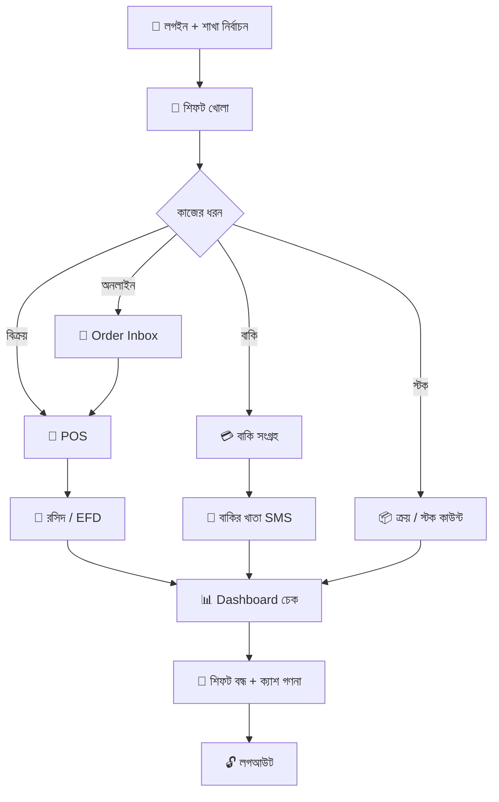

**ASCII সংক্ষিপ্ত:**

```
লগইন → শিফট খোলা → [POS | ক্রয় | বাকি সংগ্রহ | Order Inbox] → Dashboard → শিফট বন্ধ → লগআউট
```

---

### ১৮.২ POS — নগদ/MFS বিক্রয়

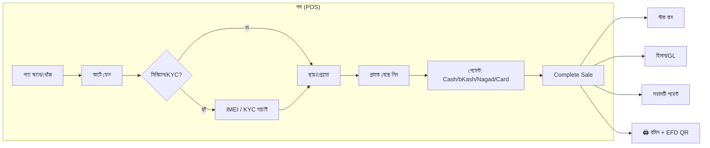

| ধাপ | কর্মী | সিস্টেম |
|-----|------|---------|
| 1 | বারকোড স্ক্যান | পণ্য + দাম লোড |
| 2 | পরিমাণ ঠিক | কার্ট আপডেট |
| 3 | (যদি লাগে) IMEI/NID | Validation |
| 4 | পেমেন্ট পদ্ধতি | Sale রেকর্ড |
| 5 | Complete | স্টক↓, GL, রসিদ |

---

### ১৮.৩ POS — বাকি বিক্রয় (Credit / Bakir Khata)

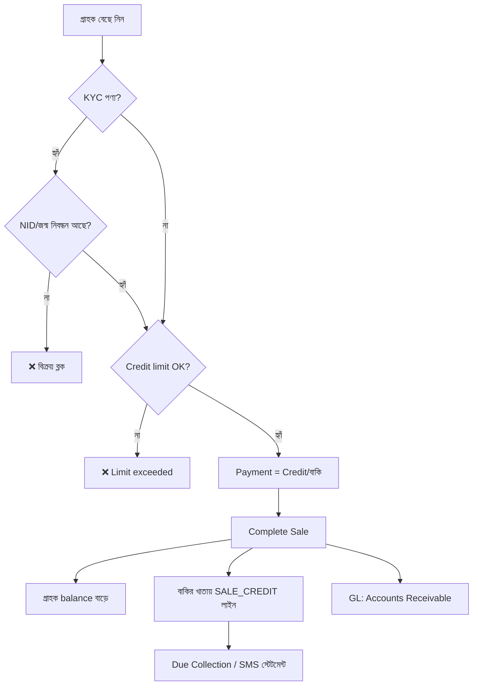

**বাকির খাতা লাইফসাইকেল:**

```
বাকি বিক্রয় (+amount) → [সময়] → জমা/সংগ্রহ (−amount) → ব্যালেন্স ০
                                      ↓
                              Bangla SMS স্টেটমেন্ট (ঐচ্ছিক)
```

---

### ১৮.৪ বাকি সংগ্রহ ও বাকির খাতা SMS

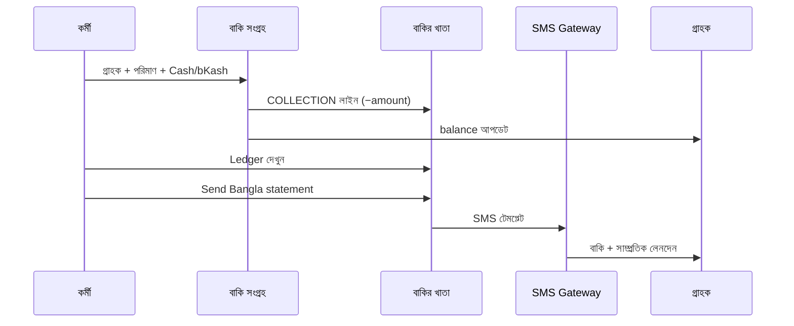

| ধাপ | পেজ | কাজ |
|-----|-----|-----|
| 1 | Due Collection | গ্রাহক, amount, method |
| 2 | (অটো) | COLLECTION ledger entry |
| 3 | Bakir Khata panel | লেনদেনের তালিকা |
| 4 | Send SMS | গ্রাহকের ফোনে বাংলা স্টেটমেন্ট |

---

### ১৮.৫ ক্রয় → স্টক → সাপ্লায়ার বাকি

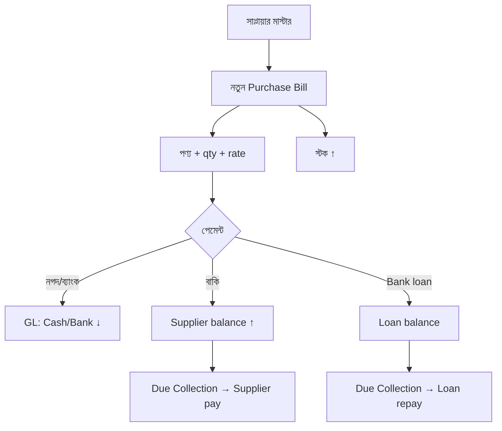

---

### ১৮.৬ বিক্রয় রিটার্ন

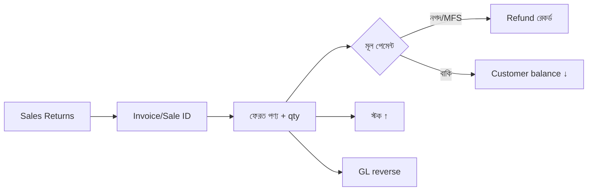

---

### ১৮.৭ শিফট (Shift) ফ্লো

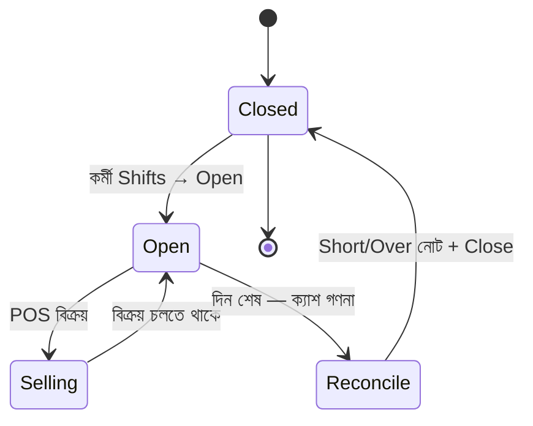

| অবস্থা | কাজ |
|--------|-----|
| Open | Opening float রেকর্ড |
| Selling | POS sales শিফটে যুক্ত |
| Reconcile | প্রত্যাশিত vs.actual cash |
| Closed | রিপোর্ট; Admin review |

---

### ১৮.৮ গ্রাহক + KYC + লয়ালটি কার্ড

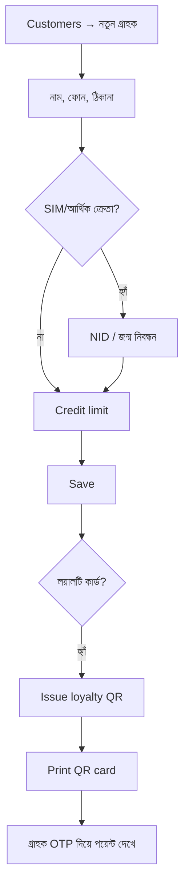

---

### ১৮.৯ KYC বাধ্যতামূলক বিক্রয় (SIM / Financial)

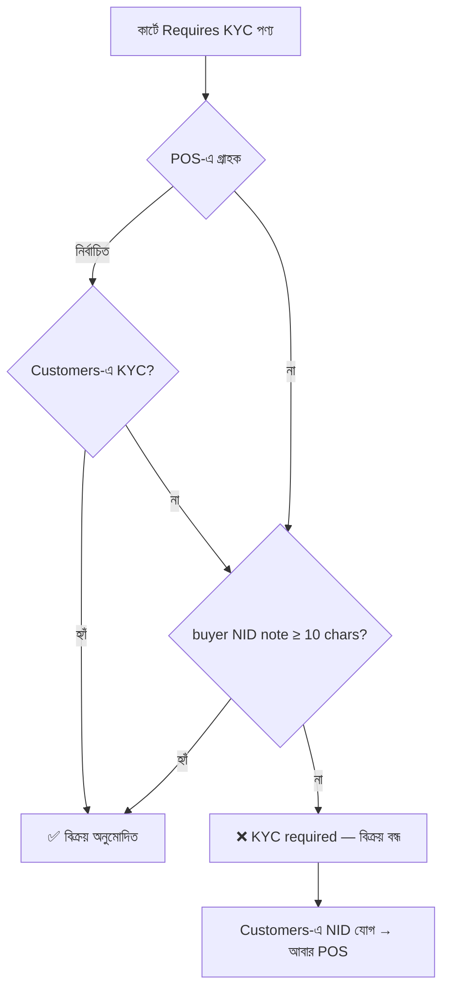

---

### ১৮.১০ ওয়ারেন্টি দাবি (Warranty Claim)

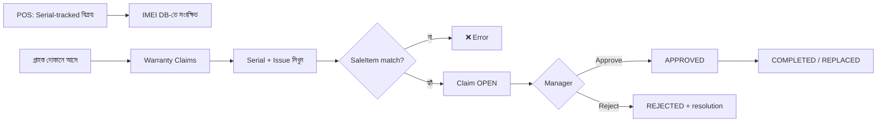

---

### ১৮.১১ অনলাইন দোকান → অর্ডার পূরণ

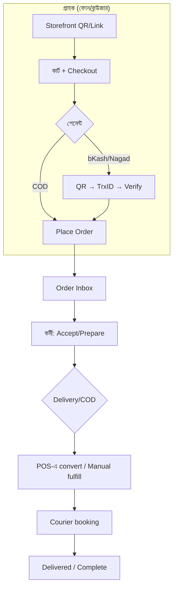

**রেস্তোরাঁ টেবিল QR:**

```
#/storefront?token=…&table=৫ → ডাইন-ইন অর্ডার (ডেলিভারি চার্জ নেই) → Kitchen/Order Inbox
```

---

### ১৮.১২ Order Inbox → POS (Fulfillment)

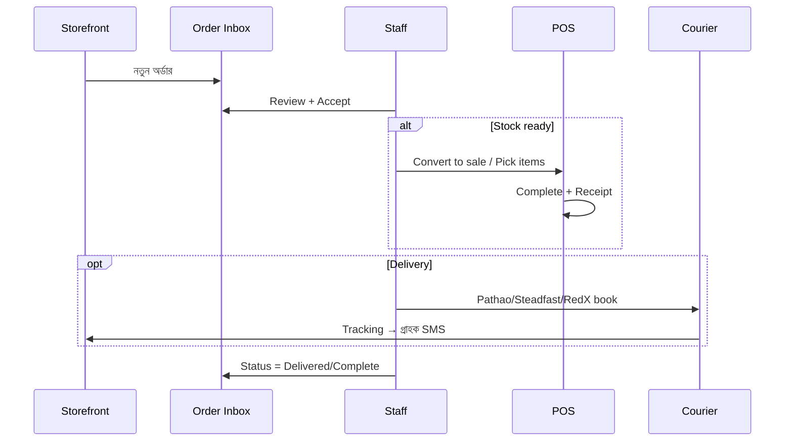

---

### ১৮.১৩ ভূমিকা অনুযায়ী প্রক্রিয়া (Role Process Maps)

#### Admin / Owner — সাপ্তাহিক/মাসিক

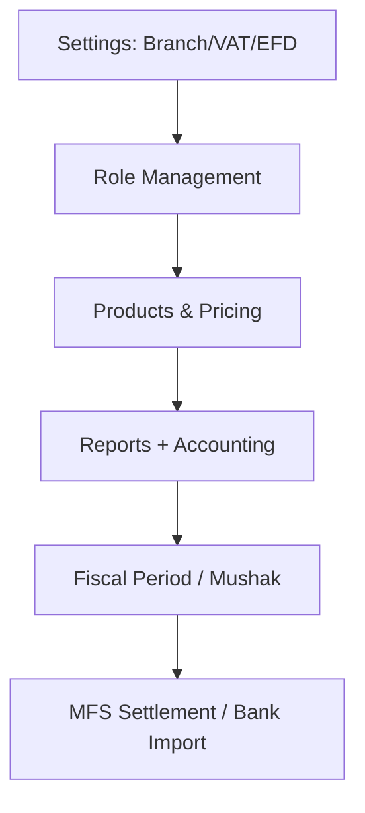

#### Cashier — দৈনিক

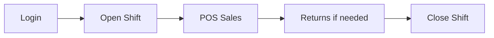

#### Inventory — দৈনিক/সাপ্তাহিক

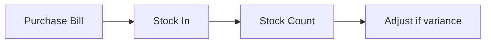

#### Manager — বাকি ও গ্রাহক


---

### ১৮.১৪ End-to-End: মাইক্রো-রিটেইল এক দিন (উদাহরণ)

**Scenario:** মুদি দোকান — নগদ বিক্রয়, একজন পরিচিত গ্রাহক বাকি নিল, বিকেলে জমা দিল।

| সময় | প্রক্রিয়া | পেজ |
|-------|-----------|-----|
| ০৯:০০ | শিফট খোলা | Shifts |
| ০৯:৩০ | ৫টি নগদ POS বিক্রয় | POS |
| ১১:০০ | বাকি বিক্রয় (credit) | POS → Bakir Khata |
| ১৫:০০ | সাপ্লায়ার থেকে ক্রয় | Purchases |
| ১৭:০০ | গ্রাহক বাকি জমা | Due Collection |
| ১৭:১৫ | Bangla SMS স্টেটমেন্ট | Bakir Khata → Send SMS |
| ২০:০০ | শিফট বন্ধ | Shifts |

```mermaid
gantt
  title মাইক্রো-রিটেইল দিন (উদাহরণ)
  dateFormat HH:mm
  axisFormat %H:%M
  section শুরু
  শিফট খোলা           :09:00, 30m
  section বিক্রয়
  নগদ POS              :09:30, 90m
  বাকি বিক্রয়         :11:00, 30m
  section ক্রয়
  Purchase bill        :15:00, 45m
  section বাকি
  বাকি সংগ্রহ + SMS    :17:00, 30m
  section শেষ
  শিফট বন্ধ           :20:00, 30m
```

---

### ১৮.১৫ প্রক্রিয়া ↔ পেজ দ্রুত ম্যাপ

| প্রক্রিয়া | শুরু | শেষ | মূল পেজ |
|-----------|------|-----|---------|
| নগদ বিক্রয় | পণ্য স্ক্যান | রসিদ | POS |
| বাকি বিক্রয় | গ্রাহক + credit | Ledger + balance | POS, Due Collection |
| বাকি জমা | amount | balance ↓ | Due Collection |
| SMS স্টেটমেন্ট | গ্রাহক select | SMS sent | Due Collection → Bakir Khata |
| ক্রয় | Supplier bill | Stock ↑ | Purchases |
| রিটার্ন | Invoice | Stock ↑ | Sales Returns |
| লয়ালটি কার্ড | Issue QR | OTP balance | Customers, #/loyalty |
| ওয়ারেন্টি | Serial | Status update | Warranty Claims |
| অনলাইন অর্ডার | Storefront | Delivered | Order Inbox, POS |
| VAT/EFD | Sale complete | Mushak XML | Sales Lookup, Settings |

---

## দ্রুত রেফারেন্স — দৈনিক কাজের চেকলিস্ট

**দিন শুরু**

- [ ] লগইন + সঠিক শাখা
- [ ] শিফট খোলা
- [ ] প্রিন্টার পরীক্ষা

**বিক্রয়ের সময়**

- [ ] পণ্য স্ক্যান/খোঁজ
- [ ] গ্রাহক (বাকি/লয়ালটি হলে)
- [ ] পেমেন্ট + রসিদ

**দিন শেষ**

- [ ] শিফট বন্ধ + ক্যাশ গণনা
- [ ] বাকি সংগ্রহ (যদি applicable)
- [ ] Dashboard sales চেক

---

## সহায়তা

- প্রযুক্তিগত সেটআপ (সার্ভার, DB, `.env`): `backend/README.md`
- Developer/API: backend source ও bootstrap endpoint

---

*BD Smart POS — বাংলাদেশের মাইক্রো-রিটেইল ও এন্টারপ্রাইজ POS*
